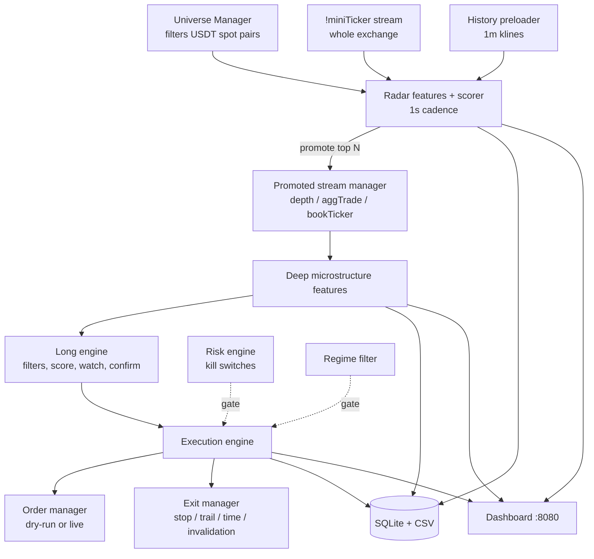

# TinyCoins Momentum Bot

An event-driven bot that watches the whole Binance Spot USDT universe for
abnormal short-term momentum in small-cap coins, promotes the most suspicious
symbols to high-resolution order-book monitoring, and tries to enter long during
the ignition phase of a move. It ships with a local web dashboard and logs every
tick, score and decision to SQLite and CSV for offline analysis.

## Status

**Experimental research sandbox. Not a finished product, and not profitable
software.** Read this before running anything:

- The default configuration is `dry_run: true` — orders are simulated and never
  sent to the exchange. Nothing in this repo has been validated with real money.
- The design document describes an **exhaustion short engine**. It is not
  implemented; only the long side exists in code.
- There are **no automated tests**. `tests/` contains an empty package only.
- There is **no backtester**. The only evaluation loop is: run it live against
  the market in dry-run, then read the CSV/SQLite dumps afterwards.
- Several thresholds were loosened during debugging (see the `fast_ignition_*`
  keys in `config.yaml` and the "V3" comments in the code) because an earlier
  version promoted many symbols and executed zero trades. Those values are
  tuned for producing signals, not for making money.
- The market regime filter thresholds are hard-coded in `main.py`, not read
  from `config.yaml`.

## How it works

The system is one asyncio process built from layers that get progressively more
expensive per symbol. The operating principle from the design doc is *detect
many, inspect few, trade fewer*.

1. **Universe** (`universe/manager.py`) — pulls exchange info and 24h tickers and
   filters down to tradeable USDT spot pairs using volume, spread, trade-count,
   quote-asset and leveraged-token rules from `config.yaml`. Refreshes every
   5 minutes into four sets: `monitored`, `radar_eligible`, `long_eligible`,
   `short_eligible`.
2. **Radar** (`radar/`) — subscribes to the cheap exchange-wide `!miniTicker`
   stream and computes five features per symbol once a second: return
   acceleration, volume burst versus baseline, spread compression, quote
   activity, and an early-buildup score. `radar/scorer.py` z-score normalises
   them, combines them with the configured weights into a composite score, and
   also computes a separate "fast ignition" score for abrupt pumps. Symbols are
   labelled (`building_pressure`, `ignition_risk`, `already_extended`,
   `illiquid_trap`, `cooling_off`, `normal`) and the top N are promoted.
   `radar/history_preloader.py` seeds the baselines at startup from 1-minute
   klines so the z-scores are not cold.
3. **High-resolution monitoring** (`monitor/`) — promoted symbols get real
   subscriptions to depth, aggTrade and bookTicker streams. `monitor/state.py`
   keeps ring buffers per symbol; `monitor/features.py` derives order-book
   imbalance, flow imbalance, ask depletion, rehydration rate, spread stability,
   volume acceleration and micro-return.
4. **Long engine** (`signals/long_engine.py`) — runs the entry funnel over
   promoted symbols: hard filters (spread, top-of-book notional, warmup,
   extension) → composite long score → persistence over N ticks → watch state →
   confirmation (local high break, buy flow, ask depletion) → entry signal.
   Fast-ignition promotions get a relaxed variant of every gate.
5. **Execution and exits** (`execution/`) — sizes the position (either the
   exchange minimum quantity or a risk-budgeted size), validates the order
   against cached symbol filters, places it through `exchange/order_manager.py`,
   and then runs hard stop, trailing stop, time stop and flow-invalidation exits.
6. **Risk** (`risk/engine.py`) — portfolio caps plus kill switches for daily
   drawdown, consecutive losses, stale market data and repeated order rejects.
   When a kill switch trips, the main loop stops opening positions.
7. **Observation** — a SQLite layer (`core/database.py`), a 1-minute CSV snapshot
   of every shortlisted coin (`logging_/csv_logger.py`), a 15-minute
   missed-opportunity report (`analysis/missed_opportunity.py`), and an aiohttp
   dashboard (`dashboard/`).



## Requirements

- Python 3.9 or newer (nothing in the code uses newer syntax; developed on
  Windows)
- A Binance account with API keys, if you want anything beyond dry-run. Read-only
  keys are enough for dry-run.

Dependencies are in `requirements.txt`: `python-binance`, `python-dotenv`,
`pyyaml`, `aiohttp`, `numpy`, `structlog`, plus `pytest` and `pytest-asyncio`
(unused so far — there are no tests).

## Setup

```bash
git clone https://github.com/chinthakat/tiny-coin-momentum-bot.git
cd tiny-coin-momentum-bot

python -m venv .venv
# Windows PowerShell
.venv\Scripts\Activate.ps1
# macOS / Linux
source .venv/bin/activate

pip install -r requirements.txt

cp .env.example .env   # then edit .env and put your keys in
```

`main.py` refuses to start if `BINANCE_API_KEY` is missing or still set to the
placeholder value.

## Configuration

Credentials come from `.env`; everything else comes from `config.yaml`.

### Environment variables

These are the only three variables the code reads (`core/config.py`). Copy
`.env.example` to `.env` and fill them in — never commit `.env`.

| Variable | Default | Purpose |
| --- | --- | --- |
| `BINANCE_API_KEY` | `""` | Binance API key. Startup aborts if unset or left as `your_api_key_here`. |
| `BINANCE_API_SECRET` | `""` | Binance API secret. |
| `BINANCE_TESTNET` | `false` | `true` routes REST and WebSocket traffic to `testnet.binance.vision`. |

### config.yaml

| Key | Default | Meaning |
| --- | --- | --- |
| `trade_mode` | `minimum_quantity` | `minimum_quantity` sizes every trade at the exchange minimum (`max(LOT_SIZE.minQty, MIN_NOTIONAL/price)`); `normal` uses risk-based sizing. |
| `dry_run` | `true` | Simulate fills instead of sending orders. |
| `dashboard_port` | `8080` | Port for the local dashboard. |
| `universe.refresh_interval_seconds` | `300` | How often the tradeable universe is rebuilt. |
| `universe.min_24h_quote_volume_usdt` | `50000` | Minimum 24h USDT volume to be monitored. |
| `universe.max_spread_pct` | `2.0` | Maximum bid-ask spread to stay in the universe. |
| `universe.min_trade_count_24h` | `500` | Minimum 24h trade count. |
| `universe.excluded_quote_assets` | `[TUSD, BUSD, FDUSD, EUR, GBP, TRY, BRL, ARS]` | Quote assets to skip. |
| `universe.excluded_base_patterns` | `[UP, DOWN, BULL, BEAR]` | Leveraged-token name patterns to skip. |
| `radar.tick_interval_seconds` | `1` | Radar scoring cadence. |
| `radar.promotion_top_n` | `10` | How many symbols get promoted to deep monitoring. |
| `radar.cooldown_seconds` | `300` | Cooldown after a symbol is invalidated. |
| `radar.weights.*` | see file | Weights for the five radar features; should sum to ~1.0. |
| `radar.promotion_score_threshold` | `0.65` | Composite score needed for promotion. |
| `radar.fast_ignition_threshold` | `1.45` | Separate threshold for abrupt-pump promotion. |
| `radar.buildup_price_range_max_pct` | `1.0` | Flat-range width that counts as build-up. |
| `radar.buildup_volume_increase_min` | `1.5` | Volume ratio versus baseline for build-up. |
| `monitor.max_promoted_symbols` | `15` | Hard cap on high-resolution subscriptions. |
| `monitor.book_depth_levels` | `20` | Depth levels requested per promoted symbol. |
| `monitor.book_update_speed_ms` | `100` | Depth stream update speed. |
| `monitor.rolling_window_seconds` | `60` | Rolling feature window. |
| `monitor.flow_window_seconds` | `5` | Trade-flow window. |
| `long_engine.max_spread_pct` | `1.5` | Hard spread filter at entry. |
| `long_engine.min_top_book_notional_usdt` | `100` | Minimum top-of-book notional. |
| `long_engine.min_warmup_seconds` | `10` | Deep-feature warmup before a symbol is tradeable. |
| `long_engine.max_extension_pct` | `5.0` | Skip entries on moves already up more than this. |
| `long_engine.score_threshold` | `0.60` | Long composite score needed. |
| `long_engine.persistence_ticks` | `2` | Consecutive ticks above threshold before watching. |
| `long_engine.max_watch_duration_seconds` | `60` | How long a watch stays alive. |
| `long_engine.confirmation_count_required` | `2` | Confirmations needed to fire an entry. |
| `long_engine.max_slippage_pct` | `0.5` | Slippage tolerance at entry validation. |
| `long_engine.max_price_beyond_trigger_pct` | `0.3` | How far past the trigger price an entry may still happen. |
| `long_engine.fast_ignition_*` | see file | Relaxed warmup, persistence, confirmations, spread and book-notional gates for fast-ignition promotions. |
| `execution.order_type` | `LIMIT` | `LIMIT` or `MARKET`. |
| `execution.fill_timeout_seconds` | `5` | Cancel an unfilled limit order after this long. |
| `execution.max_book_consumption_pct` | `10` | Never take more than this share of visible depth. |
| `exit.hard_stop_pct` | `2.0` | Stop loss. |
| `exit.time_stop_seconds` | `300` | Maximum hold time. |
| `exit.trailing_stop_activation_pct` | `1.0` | Gain at which the trailing stop arms. |
| `exit.trailing_stop_distance_pct` | `0.5` | Trailing distance. |
| `exit.flow_invalidation_exit` | `true` | Exit immediately when the flow thesis breaks. |
| `risk.max_risk_per_trade_pct` | `1.0` | Risk budget per trade, percent of capital. |
| `risk.max_concurrent_positions` | `3` | Position count cap. |
| `risk.max_total_exposure_pct` | `10.0` | Portfolio exposure cap. |
| `risk.max_daily_drawdown_pct` | `3.0` | Kill switch on daily loss. |
| `risk.max_consecutive_losses` | `5` | Kill switch on losing streak. |
| `risk.stale_data_timeout_seconds` | `30` | Kill switch when market data stops arriving. |
| `risk.max_order_rejects` | `5` | Kill switch on consecutive order rejects. |
| `risk.symbol_blacklist` | `[]` | Symbols to never trade. |
| `logging.log_dir` | `logs` | Where rotating log files are written. |
| `logging.level` | `INFO` | Log level. |
| `logging.rotation_mb` | `50` | Log rotation size. |
| `logging.retention_days` | `30` | Log retention. |
| `logging.structured_json` | `true` | JSON log output via structlog. |

Some dataclass fields in `core/config.py` have no matching key in the shipped
`config.yaml` and therefore always take their defaults:
`execution.risk_per_trade_usd` (5.0), `execution.max_notional_per_trade` (50.0),
`execution.max_slippage_pct` (0.3), `risk.max_total_notional` (200.0),
`risk.max_symbol_notional` (50.0), and
`long_engine.max_depth_coeff_of_variation` (0.5). Add them to `config.yaml` if
you want to change them.

## Usage

There is one entry point:

```bash
python main.py
```

That starts the exchange client, syncs the clock, builds the universe, preloads
radar history, opens the streams, starts the dashboard and enters the trading
loop. Press Ctrl+C to stop; shutdown closes open positions, flushes the database
and prints a session summary with the signal funnel counts.

The dashboard is served at `http://localhost:8080` (configurable via
`dashboard_port`) and exposes:

| Endpoint | Returns |
| --- | --- |
| `GET /` | The single-page dashboard. |
| `GET /api/status` | Connection health, universe sizes, clock offset, config summary. |
| `GET /api/radar` | Promoted symbols with scores, labels and radar features. |
| `GET /api/positions` | Open positions with unrealised PnL. |
| `GET /api/trades` | Closed trade history. |
| `GET /api/coin/{symbol}` | Deep microstructure detail for one symbol. |

### Runtime output

Everything below is generated at runtime and is git-ignored:

- `data/tinycoins.db` — SQLite with `runs`, `ticks`, `radar_scores`,
  `deep_features`, `promotions`, `signals` and `trades` tables. Each start
  creates a new `run_id`, and rows belonging to runs older than the most recent
  three are deleted at startup.
- `data/shortlist_data_<date>.csv` — a snapshot of every shortlisted coin with
  40+ feature columns, written once a minute. This file grows fast: a session
  that was previously committed to this repo held roughly 80,000 rows / 19 MB
  from under four hours of running.
- `data/missed_opportunities_<date>.csv` — every 15 minutes, the top movers and
  whether the system scored, promoted, monitored or traded them.
- `logs/` — rotating structlog JSON logs.

## Project layout

```
main.py                  Orchestrator: wires every component and runs the async loop
config.yaml              All tunable strategy, execution, exit and risk parameters
.env.example             Template for the three Binance credentials
core/                    Config loader, exchange clock, normalised event types, SQLite layer
exchange/                Async Binance REST client, symbol-filter cache, order manager, WebSocket manager
universe/                Builds and refreshes the tradeable symbol universe
radar/                   Exchange-wide scanning: features, scorer, service loop, history preload, regime filter
monitor/                 Per-symbol rolling state and deep microstructure features for promoted symbols
signals/                 Symbol lifecycle state machine and the ignition long engine
execution/               Position sizing, entry validation, and the exit manager
risk/                    Portfolio limits and kill switches
analysis/                Missed-opportunity reporting
logging_/                Structlog setup and the 1-minute CSV data logger
dashboard/               aiohttp server and the single-page UI in dashboard/static
tests/                   Empty package — no tests written yet
docs/                    system-design.md (the specification) and history/ (development log)
```

## Tests

None. `requirements.txt` pins `pytest` and `pytest-asyncio` and `tests/` exists
as an empty package, so `pytest` runs and collects zero tests. Any behaviour
described here was observed by running the system, not by a test suite.

## Documentation

- [`docs/system-design.md`](docs/system-design.md) — the full specification:
  strategy philosophy, layer responsibilities, feature definitions, radar and
  long-engine mechanics, risk model, operating procedures. Written before the
  code and still the best description of intent. Note that it also specifies a
  short engine that was never built.
- [`docs/history/`](docs/history/README.md) — chronological development log:
  build walkthrough, dashboard plan, and the two code reviews that drove the V2
  and V3 threshold changes.

## Risk and disclaimer

This is trading software targeting the most volatile, least liquid corner of a
crypto exchange. It can and will lose money.

- **Nothing here is financial advice.** This repository is a personal research
  project published for reference.
- **Trading real funds risks total loss.** Small-cap crypto pumps are frequently
  manipulated; a strategy that tries to ride them is trading against people who
  know where the move ends and you do not.
- **Start in dry-run, then testnet.** `dry_run: true` and
  `trade_mode: minimum_quantity` are the defaults for a reason. Set
  `BINANCE_TESTNET=true` before you ever set `dry_run: false`.
- **The kill switches are not a safety net.** Drawdown, stale-data and
  reject-count switches are best-effort and have not been tested under exchange
  outages, partial fills or reconnect storms.
- **You are responsible for your own keys and your own losses.** Use API keys
  scoped to spot trading only, never enable withdrawals, and keep `.env` out of
  version control.

## License

MIT — see [LICENSE](LICENSE).
