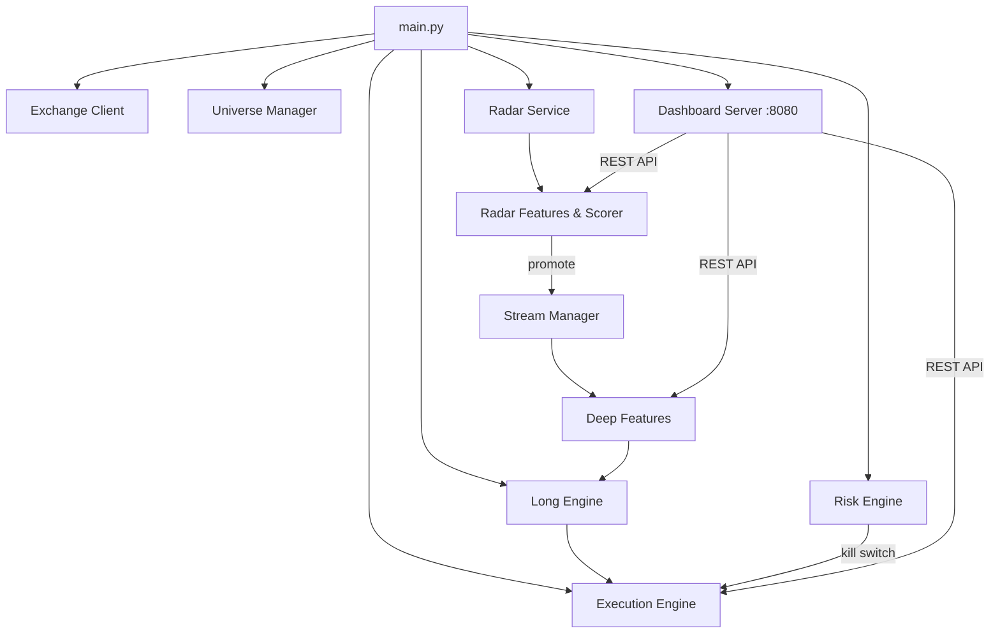

# TinyCoins Momentum Trading System — Walkthrough

## What Was Built

A complete **multi-layer crypto momentum trading system** for Binance Spot with a **live web dashboard**.

### Architecture



**20+ Python modules** across 11 packages, implementing the full pipeline from the strategy document.

---

## Web Dashboard

Premium dark-themed dashboard with auto-refresh every 5 seconds at `http://localhost:8080`.

### Dashboard Tab
Shows connection status, universe stats, and all shortlisted coins with radar scores, labels, returns, volume burst, and buildup metrics. Click any coin for deep microstructure details.


### Orders & Trades Tab
Shows daily PnL, win rate, drawdown, risk status, active positions with unrealized PnL, and completed trade history.


---

## Minimum Quantity Mode

When `trade_mode: "minimum_quantity"`:
- `metadata.get_min_trade_quantity()` computes `max(LOT_SIZE.minQty, MIN_NOTIONAL/price)` rounded up to stepSize
- All scoring, signals, risk limits, and kill switches still operate normally

---

## How to Run

```powershell
cd c:\Projects\Trading\TinyCoins
python main.py
# Dashboard opens at http://localhost:8080
```

> [!TIP]
> Defaults: `dry_run: true` + `trade_mode: minimum_quantity`. Set `dry_run: false` in `config.yaml` when ready for live minimum-quantity trading.
